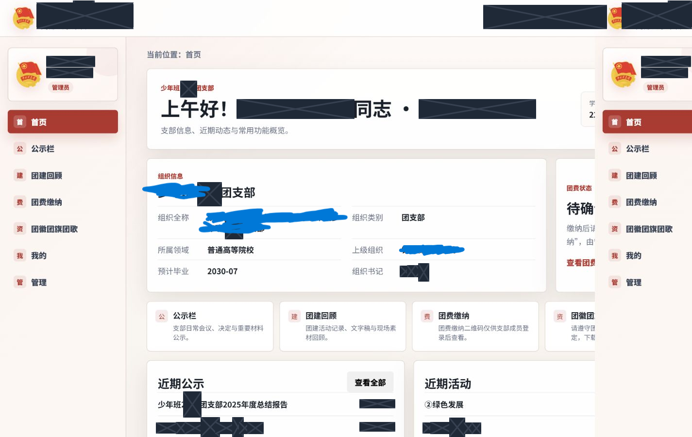

# 少年班 2402 团支部内部公示平台

这是一个面向小规模团支部的 Cloudflare Pages OA 平台。系统提供首页、公示、团建回顾、团费缴纳、团徽团旗团歌资料、成员管理和分组站点设置，并为敏感下载生成带身份、北京时间和用途的水印副本。



## 主要功能

- 首页：展示问候、学号、支部信息、模块入口、个人团费状态及近期内容。
- 公示与活动：提供独立列表和详情路由、PDF/图片预览、搜索、筛选和排序。
- 团费与资料：展示缴费二维码和紧凑统计，并提供不强制加水印的官方团徽团旗团歌资料。
- 账户与管理：支持 `admin`、`editor`、`member` 三种角色，以及用户、内容、附件、团费、存储和站点设置管理。
- 安全下载：私有 R2 文件经过服务端鉴权，敏感 PDF/图片下载生成与用户绑定的水印衍生文件。

## 文档导航

- [用户使用手册](docs/USER_GUIDE.md)：登录、首页、浏览、搜索、缴费确认、下载和个人资料。
- [管理员使用手册](docs/ADMIN_GUIDE.md)：内容、附件、用户、角色、团费、存储和分组站点设置。
- [开发者手册](docs/DEVELOPER_GUIDE.md)：架构、数据模型、安全控制、PDF 处理、缓存、响应式设计和测试。
- [部署与安全手册](docs/DEPLOYMENT_AND_SECURITY.md)：Cloudflare D1、R2、Turnstile、迁移、发布和运维。
- [安全整改记录](docs/SECURITY_REMEDIATION.md)：安全评估问题的逐项处置结果和残余风险。

## 技术栈

- Cloudflare Pages Advanced Mode（`public/_worker.js`）
- Cloudflare D1、私有 R2 与 Turnstile
- 原生 HTML、CSS 和 JavaScript
- `@cantoo/pdf-lib` 与 `@pdf-lib/fontkit`

## 本地运行与验证

```powershell
npm.cmd install
npx.cmd wrangler pages dev public --port 8788
npm.cmd run check
npm.cmd run verify:local
npm.cmd run predeploy
```

本地地址为 `http://127.0.0.1:8788`。真实账户、支付二维码、私密材料和 Cloudflare 密钥不得提交到公开仓库。

## PDF 与安全边界

现有 PDF 采用增量更新追加水印，使原始字节、嵌入字体、页面资源、注释和尺寸保持不变。查看器权限标记不是 DRM；水印也不能阻止截图、拍照或人工转录，因此必须同时依赖服务端鉴权、私有对象存储和下载审计。

## 响应式验证

2026-06-22 的回归覆盖 1440px 桌面及 390–430px 手机视口，包括登录、首页、公示、活动、团费、资料、“我的”、管理首页、站点设置、空间统计和手机抽屉。验证截图位于 [`docs/images/validation-2026-06-22`](docs/images/validation-2026-06-22)。

最后更新时间：2026-06-22（北京时间）

---

# Youth League Branch 2402 Internal Information Platform

This is a Cloudflare Pages OA platform for a small Youth League branch. It provides a home page, notices, activity reviews, membership-fee payments, official emblem/flag/song resources, member administration, and grouped site settings. Sensitive downloads receive identity-, Beijing-time-, and purpose-bound watermarks.


## Main Features

- Home: shows the greeting, student ID, branch information, module shortcuts, personal payment status, and recent content.
- Notices and activities: provide separate list and detail routes, PDF/image previews, search, filtering, and sorting.
- Fees and resources: display the payment QR code and compact statistics, and provide official emblem/flag/song materials without mandatory watermarking.
- Accounts and administration: support the `admin`, `editor`, and `member` roles plus user, content, attachment, payment, storage, and site-settings management.
- Protected downloads: private R2 files require server-side authorization, while sensitive PDF/image downloads produce user-bound watermarked derivatives.

## Documentation

- [User Guide](docs/USER_GUIDE.md): sign-in, home, browsing, search, payment confirmation, downloads, and profile.
- [Administrator Guide](docs/ADMIN_GUIDE.md): content, attachments, users, roles, payments, storage, and grouped site settings.
- [Developer Guide](docs/DEVELOPER_GUIDE.md): architecture, data model, security controls, PDF processing, caching, responsive design, and testing.
- [Deployment and Security Guide](docs/DEPLOYMENT_AND_SECURITY.md): Cloudflare D1, R2, Turnstile, migrations, releases, and operations.
- [Security Remediation Record](docs/SECURITY_REMEDIATION.md): finding-by-finding remediation results and residual risks.

## Technology Stack

- Cloudflare Pages Advanced Mode (`public/_worker.js`)
- Cloudflare D1, private R2, and Turnstile
- Native HTML, CSS, and JavaScript
- `@cantoo/pdf-lib` and `@pdf-lib/fontkit`

## Local Run and Verification

```powershell
npm.cmd install
npx.cmd wrangler pages dev public --port 8788
npm.cmd run check
npm.cmd run verify:local
npm.cmd run predeploy
```

The local URL is `http://127.0.0.1:8788`. Never commit real accounts, payment QR codes, private materials, or Cloudflare secrets to a public repository.

## PDF and Security Boundaries

Existing PDFs receive watermarks through incremental updates, preserving their original bytes, embedded fonts, page resources, annotations, and dimensions. Viewer permission flags are not DRM, and watermarks cannot prevent screenshots, photography, or manual transcription. Server-side authorization, private object storage, and download auditing therefore remain mandatory.

## Responsive Verification

The 2026-06-22 regression covers a 1440px desktop and 390–430px mobile viewports, including sign-in, home, notices, activities, payments, resources, Profile, the administration dashboard, site settings, storage statistics, and the mobile drawer. Verification screenshots are stored in [`docs/images/validation-2026-06-22`](docs/images/validation-2026-06-22).

Last updated: 2026-06-22 (Beijing Time)
