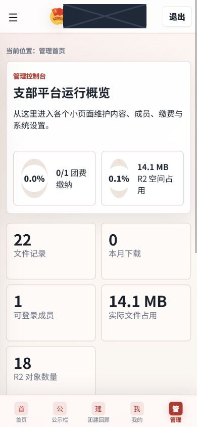

# 管理员使用手册

## 1. 管理首页

管理首页汇总文件记录、本月下载、成员数量、内容数量、团费进度和 R2 占用。应用内图表是业务估算，不替代 Cloudflare Dashboard 的账单与用量数据。

## 2. 身份与权限

| 身份 | 实际权限 |
|---|---|
| `admin` | 用户、角色、内容、附件、团费、设置、统计和安全配置的完整权限 |
| `editor` | 新建、编辑、发布、归档内容和管理附件；不能管理用户或关键设置 |
| `member` | 浏览获准内容、下载文件、修改本人资料和提交本人团费状态 |

系统阻止禁用或降级最后一名可用管理员。修改角色、禁用用户或重置密码会撤销该用户的既有会话。

## 3. 内容与附件

内容类型为 `notice`、`activity`、`payment` 和 `download`；状态为 `published`、`draft` 和 `archived`。公告和团费内容固定为成员可见。删除会永久移除记录及关联附件，必须在明确确认后执行，日常下线优先使用归档。

附件白名单包括 PDF、PNG、JPEG、MP3、TXT、DOCX 和 PPTX。服务器检查扩展名、MIME、文件特征和大小；普通附件最大 30 MB，图片最大 12 MB。

## 4. 用户与团费

用户管理支持新增学号、修改昵称/支部、分配身份、禁用账户和重置密码。不要保存身份证号、手机号或家庭地址等无关敏感信息。

管理员可查看全体团费状态并逐人校正；成员只能查看和更新自己的状态。统计卡片提供进度、待确认和已缴纳数量。

## 5. 分组站点设置

设置按八组折叠显示：品牌与基础信息、首页与组织信息、页面名称与说明、水印与下载、团费、安全、配额与性能、开发者与页脚。沿用既有 setting key，不会因界面分组覆盖线上设置。

## 6. PDF 与水印

需水印附件应启用 `watermark_required`；官方团徽团旗团歌资料通常关闭。受保护 PDF 可临时提供所有者密码，密码只用于当次处理，不写入 D1、R2、日志或浏览器缓存。现有 PDF 以增量方式追加水印，查看器权限标记不作为安全边界。

## 7. 安全操作

- 管理员使用独立高强度密码，禁止多人共用。
- 每月检查下载日志、R2 完整分页统计和管理员名单。
- 不要把 Turnstile Secret、初始密码表或 `.dev.vars` 提交到仓库。
- 部署和清理不得擅自删除 R2 对象或用户数据。

最后更新时间：2026-06-22（北京时间）

---

# Administrator Guide

## 1. Administration Dashboard

The dashboard summarizes file records, monthly downloads, member count, content count, payment progress, and R2 usage. In-app charts are business estimates and do not replace Cloudflare Dashboard billing and usage data.

## 2. Roles and Permissions

| Role | Effective permissions |
|---|---|
| `admin` | Full control of users, roles, content, attachments, payments, settings, statistics, and security configuration |
| `editor` | Creates, edits, publishes, and archives content and manages attachments; cannot manage users or critical settings |
| `member` | Browses authorized content, downloads files, edits their own profile, and submits their own payment status |

The system prevents disabling or demoting the last usable administrator. Role changes, account disabling, and password resets revoke the affected user’s existing sessions.

## 3. Content and Attachments

Content types are `notice`, `activity`, `payment`, and `download`; statuses are `published`, `draft`, and `archived`. Notices and payment content are always member-visible. Deletion permanently removes records and associated attachments and requires explicit confirmation; use archiving for routine withdrawal.

Allowed attachments include PDF, PNG, JPEG, MP3, TXT, DOCX, and PPTX. The server checks extension, MIME type, file signature, and size; general attachments are limited to 30 MB and images to 12 MB.

## 4. Users and Payments

User administration supports adding student IDs, editing nickname/branch, assigning roles, disabling accounts, and resetting passwords. Do not store unrelated sensitive data such as identity-card numbers, phone numbers, or home addresses.

Administrators can view all payment statuses and correct each member’s record; members can only view and update their own status. Statistics cards show progress, pending confirmation, and paid counts.

## 5. Grouped Site Settings

Settings appear in eight collapsible groups: branding/basic information, home/organization, page labels/descriptions, watermark/downloads, payments, security, quota/performance, and developer/footer. Existing setting keys are retained, so grouping the interface does not overwrite production settings.

## 6. PDFs and Watermarks

Enable `watermark_required` for protected attachments; official emblem/flag/song resources normally leave it disabled. A protected PDF may receive a temporary owner password, used only for that processing request and never written to D1, R2, logs, or browser caches. Existing PDFs receive watermarks incrementally, and viewer permission flags are not treated as a security boundary.

## 7. Security Operations

- Administrators use separate strong passwords and never share accounts.
- Review download logs, complete paginated R2 statistics, and administrator accounts monthly.
- Never commit Turnstile secrets, initial-password sheets, or `.dev.vars`.
- Deployment and cleanup must not delete R2 objects or user data without explicit approval.

Last updated: 2026-06-22 (Beijing Time)
