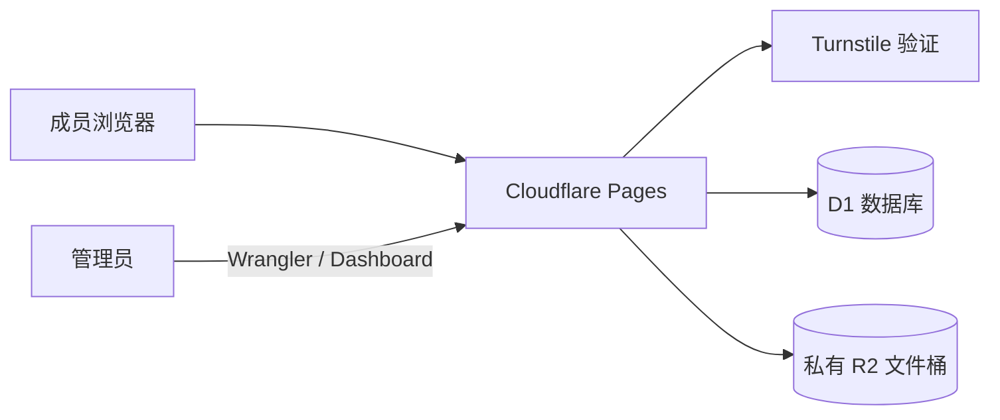
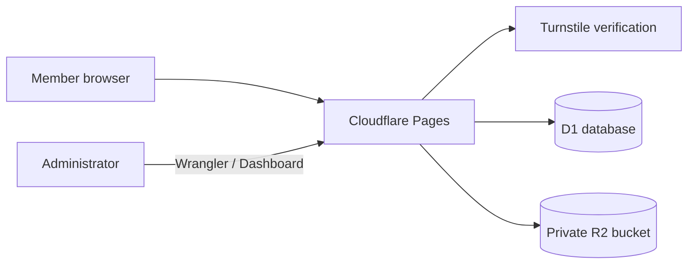

# 部署与安全运维手册

## 1. Cloudflare 资源

项目使用一个 Pages 项目、一个 D1 数据库、一个私有 R2 Bucket 和一个 Turnstile Managed Widget。R2 不开放公共域名，所有文件必须经 Worker 鉴权。免费额度和规则可能变化，部署前及每月都应在 Dashboard 核对。



## 2. 必需绑定

| 类型 | 名称 | 目标 |
|---|---|---|
| D1 | `DB` | `oa_tuanjian` |
| R2 | `FILES` | `oa-tuanjian-files` |
| Secret | `TURNSTILE_SITE_KEY` | Turnstile Site Key |
| Secret | `TURNSTILE_SECRET_KEY` | Turnstile Secret Key |

密钥只通过 Wrangler 或 Dashboard Secrets 保存，禁止写入代码、README、截图或提交历史。

## 3. 部署命令

```powershell
npx.cmd wrangler login
npx.cmd wrangler d1 execute oa_tuanjian --remote --file=db/schema.sql
npx.cmd wrangler pages secret put TURNSTILE_SITE_KEY --project-name oa-tuanjian
npx.cmd wrangler pages secret put TURNSTILE_SECRET_KEY --project-name oa-tuanjian
npx.cmd wrangler pages deploy public --project-name oa-tuanjian
```

已有数据库只执行尚未应用的增量迁移。部署命令只发布 `public/`，不得重建数据库、覆盖生产用户或删除 R2 对象。

## 4. 发布检查

1. `npm.cmd run check`、`npm.cmd run verify:local` 和 `npm.cmd run predeploy` 通过。
2. Turnstile、正确/错误登录、首次改密、退出和角色权限正常。
3. 无 CSRF 的写请求返回 `403`，普通成员不能访问管理 API。
4. PDF/图片可预览，需水印下载不暴露 R2 原件，代表性 PDF 保留字体和原始字节。
5. 390–430px 手机和 1440px 桌面逐页无横向溢出，导航、页脚和抽屉可用。
6. Cloudflare Security、Functions、D1 和 R2 指标无持续异常。

部署前先报告测试结果；部署后再在生产地址重复匿名配置、登录页、安全响应头和关键页面检查。

## 5. 用量、备份与下线

应用内存储图表不能替代 Cloudflare Billing/Usage。每月导出 D1 并保存完整分页的 R2 对象清单；备份应加密并限制访问。下线时必须另行批准，先导出必要记录，再删除 Pages、D1、R2 和 Turnstile 资源。

最后更新时间：2026-06-22（北京时间）

---

# Deployment and Security Operations Guide

## 1. Cloudflare Resources

The project uses one Pages project, one D1 database, one private R2 bucket, and one Turnstile Managed Widget. R2 has no public domain, and every file requires Worker authorization. Free-tier limits and rules can change, so verify them in the Dashboard before deployment and monthly.



## 2. Required Bindings

| Type | Name | Target |
|---|---|---|
| D1 | `DB` | `oa_tuanjian` |
| R2 | `FILES` | `oa-tuanjian-files` |
| Secret | `TURNSTILE_SITE_KEY` | Turnstile Site Key |
| Secret | `TURNSTILE_SECRET_KEY` | Turnstile Secret Key |

Store secrets only through Wrangler or Dashboard Secrets. Never place them in code, README files, screenshots, or commit history.

## 3. Deployment Commands

```powershell
npx.cmd wrangler login
npx.cmd wrangler d1 execute oa_tuanjian --remote --file=db/schema.sql
npx.cmd wrangler pages secret put TURNSTILE_SITE_KEY --project-name oa-tuanjian
npx.cmd wrangler pages secret put TURNSTILE_SECRET_KEY --project-name oa-tuanjian
npx.cmd wrangler pages deploy public --project-name oa-tuanjian
```

For an existing database, apply only unapplied incremental migrations. The deployment command publishes only `public/`; it must not recreate the database, overwrite production users, or delete R2 objects.

## 4. Release Checks

1. `npm.cmd run check`, `npm.cmd run verify:local`, and `npm.cmd run predeploy` pass.
2. Turnstile, correct/incorrect sign-in, forced password change, sign-out, and role authorization work.
3. Mutations without CSRF return `403`, and ordinary members cannot access administration APIs.
4. PDFs/images preview correctly, protected downloads do not expose R2 originals, and a representative PDF retains fonts and original bytes.
5. All pages at 390–430px mobile and 1440px desktop have no horizontal overflow, and navigation, footers, and the drawer work.
6. Cloudflare Security, Functions, D1, and R2 metrics show no sustained anomaly.

Report test results before deployment; after deployment, repeat anonymous configuration, sign-in page, security headers, and critical-page checks on the production URL.

## 5. Usage, Backups, and Retirement

In-app storage charts do not replace Cloudflare Billing/Usage. Export D1 monthly and retain a completely paginated R2 object inventory; encrypt backups and restrict access. Retirement requires separate approval: export required records before deleting Pages, D1, R2, and Turnstile resources.

Last updated: 2026-06-22 (Beijing Time)
