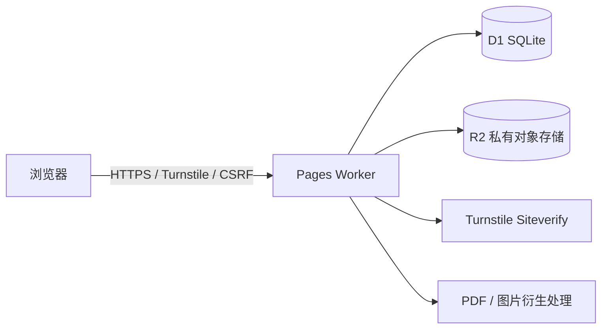
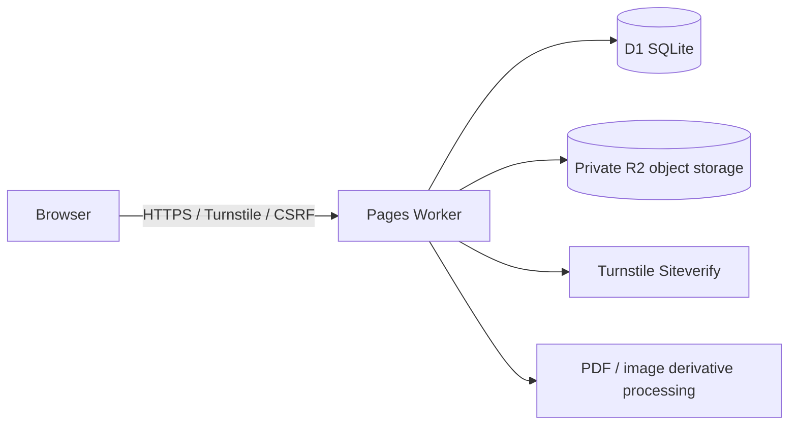

# 开发者手册

## 1. 架构



`public/_worker.js` 是静态资源、API、认证、授权、文件流和衍生文件的单一服务端入口。`public/app.js` 是无框架客户端，使用真实 URL 路由渲染页面和导航。

## 2. 数据模型

- `users`：学号、昵称、支部、PBKDF2 密码、角色、启用和强制改密状态。
- `sessions`：哈希后的会话令牌、CSRF 令牌和到期时间。
- `content_items`：类型、状态、可见性、日期、排序和正文样式。
- `files`：R2 对象键、MIME、大小、水印策略和可见性。
- `download_logs`：下载者、文件、时间和结果。
- `payment_status`：成员与缴纳状态。
- `settings`：站点文案、首页信息、模块名称、安全提示和页脚链接。

数据库结构见 `db/schema.sql`，增量迁移位于 `db/migrations/`。

## 3. 安全设计

- 密码：PBKDF2-SHA-256，210,000 次，随机盐和常量时间比较。
- 会话：`HttpOnly; Secure; SameSite=Strict` Cookie，服务端只保存令牌哈希。
- CSRF：每会话独立令牌，写操作同时校验令牌和同源 `Origin`。
- 登录：Turnstile、账号/IP 多维限速和统一错误信息。
- 授权：路由级角色检查，文件访问再次检查内容状态和可见性。
- 输入：参数化 SQL、输出转义、上传白名单、Magic Bytes、大小限制和文件名清洗。
- 浏览器：CSP、HSTS、同站 PDF 嵌入、`nosniff` 和严格 Referrer Policy。
- 缓存：认证 HTML/API 和私有文件使用 `no-store`；公开静态资源可长期缓存。

## 4. PDF 与性能路径

现有 PDF 使用 `@cantoo/pdf-lib` 增量更新追加水印，避免全量重写或权限加密改变子集中文字体流。测试应确认输出完整保留原始 PDF 字节前缀，并用 Poppler 逐页比较。图片生成的新 PDF 可带查看器权限标记，但该标记不是安全边界。

短时内存缓存覆盖设置、用户、文件授权和衍生文件存在性；写操作主动失效相关缓存。预览直接流式读取私有 R2，水印衍生物首次生成后复用。前端并行加载、空闲预取、图片懒加载并避免重复会话请求。

## 5. 响应式设计

前端结合视口宽度和粗指针检测设备。`<=820px` 使用手机布局、底部导航和抽屉；桌面使用固定侧栏。验证覆盖 390–430px 手机和 1440px 桌面，并检查横向溢出、导航选中态、抽屉遮罩和滚动锁定。

## 6. 开发与测试

```powershell
npm.cmd install
npm.cmd run local:init
npm.cmd run dev:background
npm.cmd run verify:local
npm.cmd run check
npm.cmd run predeploy
```

验证包括登录、首次改密、会话、角色、CSRF 拒绝、内容接口、Range 下载、水印 PDF、桌面/手机逐页布局和 PDF 渲染。测试产物不得包含生产密码或远端 R2 原件。

最后更新时间：2026-06-22（北京时间）

---

# Developer Guide

## 1. Architecture



`public/_worker.js` is the single server entry point for static assets, APIs, authentication, authorization, file streaming, and derivatives. `public/app.js` is the framework-free client that renders pages and navigation on real URL routes.

## 2. Data Model

- `users`: student ID, nickname, branch, PBKDF2 password, role, enabled status, and forced-password-change status.
- `sessions`: hashed session token, CSRF token, and expiry time.
- `content_items`: type, status, visibility, date, ordering, and body styles.
- `files`: R2 object key, MIME type, size, watermark policy, and visibility.
- `download_logs`: downloader, file, time, and result.
- `payment_status`: member and payment status.
- `settings`: site text, home information, module labels, security notices, and footer links.

The database structure is in `db/schema.sql`, with incremental migrations under `db/migrations/`.

## 3. Security Design

- Passwords: PBKDF2-SHA-256 with 210,000 iterations, random salts, and constant-time comparison.
- Sessions: `HttpOnly; Secure; SameSite=Strict` cookies; only token hashes are stored server-side.
- CSRF: a per-session token; mutations validate both the token and same-origin `Origin`.
- Sign-in: Turnstile, multidimensional account/IP rate limiting, and uniform error messages.
- Authorization: route-level role checks plus content-status and visibility checks for file access.
- Input: parameterized SQL, output escaping, upload allowlists, Magic Bytes, size limits, and filename sanitization.
- Browser: CSP, HSTS, same-site PDF embedding, `nosniff`, and a strict Referrer Policy.
- Caching: authenticated HTML/API and private files use `no-store`; public static assets may be cached long-term.

## 4. PDF and Performance Path

Existing PDFs use `@cantoo/pdf-lib` incremental updates to append watermarks, avoiding full rewrites or permission encryption that can alter subset Chinese font streams. Tests confirm that output retains the complete source-PDF byte prefix and compare every page with Poppler. Newly generated image PDFs may carry viewer permission flags, but those flags are not a security boundary.

Short-lived memory caches cover settings, users, file authorization, and derivative existence; writes invalidate related caches. Previews stream directly from private R2, while derivatives are generated once and reused. The client loads in parallel, prefetches when idle, lazy-loads images, and avoids repeated session requests.

## 5. Responsive Design

The client combines viewport width with coarse-pointer detection. At `<=820px`, it uses the mobile layout, bottom navigation, and drawer; desktops use a fixed sidebar. Verification covers 390–430px mobile and 1440px desktop, checking horizontal overflow, active navigation, drawer backdrop, and scroll locking.

## 6. Development and Testing

```powershell
npm.cmd install
npm.cmd run local:init
npm.cmd run dev:background
npm.cmd run verify:local
npm.cmd run check
npm.cmd run predeploy
```

Verification covers sign-in, forced password changes, sessions, roles, CSRF rejection, content APIs, Range downloads, watermarked PDFs, desktop/mobile route layouts, and PDF rendering. Test artifacts must not contain production passwords or original remote R2 files.

Last updated: 2026-06-22 (Beijing Time)
