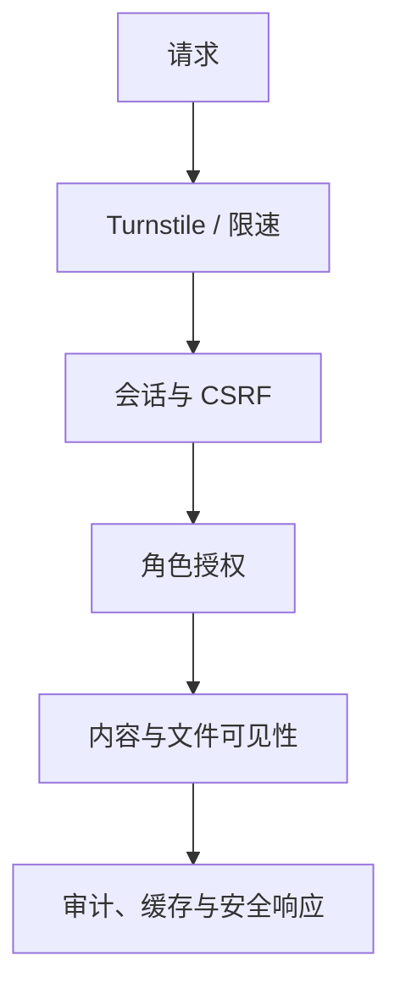
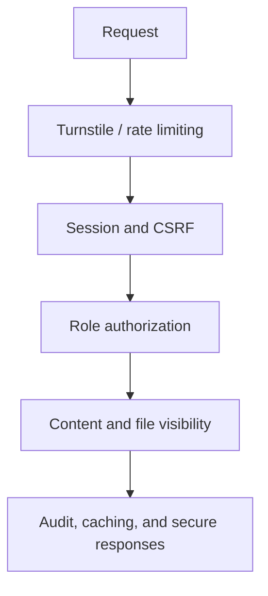

# 2026-06-20 安全整改记录

本记录对应 `安全评估-2026-06-20`。整改目标不是隐藏前端源码，而是保证绕过界面的请求仍须经过认证、授权、文件可见性检查和审计。

## 整改结果

| 编号 | 整改结果 |
|---|---|
| C-01 登录防护 | Turnstile、账号/IP 多维限速、统一错误响应和失败清理 |
| C-02 CSRF | 每会话 CSRF Token 和同源 Origin 校验 |
| C-03 口令 | PBKDF2 210,000 次、旧散列升级和最低 12 位 |
| C-04 会话 | 安全 Cookie、令牌哈希及改密/重置/角色变更后撤销 |
| C-05 权限 | `admin`/`editor`/`member` 路由鉴权和最后管理员保护 |
| C-06 文件 | 私有 R2、类型/特征/大小校验及内容可见性二次鉴权 |
| C-07 下载绕过 | 需水印用户无法取得原件，衍生处理失败时关闭访问 |
| C-08 注入与输出 | 参数化 SQL、HTML 转义、文件名清洗和严格 CSP |
| C-09 浏览器策略 | HSTS、CSP、MIME 嗅探保护和私有 `no-store` |
| C-10 隐私 | 普通用户看不到全员团费名单，仪表盘只返回必要聚合 |
| C-11 加密 PDF | 所有者密码一次性使用且不保存；增量水印保留原始资源和嵌入字体 |
| C-12 审计与资源 | 下载日志、短时缓存、上传限制、用量看板和运维清单 |

## 残余风险

为避免权限加密破坏子集中文字体，现有 PDF 不依赖查看器权限标记。水印不能阻止复制、截图、拍照或人工转录；Cloudflare 免费额度和规则可能变化；管理员终端失陷仍可能暴露已授权数据。必须坚持最小数据收集、强密码、独立管理员账号和定期检查。

最后更新时间：2026-06-22（北京时间）

---

# Security Remediation Record, 2026-06-20

This record corresponds to `安全评估-2026-06-20`. The goal is not to hide client source code, but to ensure that requests bypassing the interface still undergo authentication, authorization, file-visibility checks, and auditing.

## Remediation Results

| ID | Remediation result |
|---|---|
| C-01 Sign-in protection | Turnstile, multidimensional account/IP limits, uniform errors, and failure cleanup |
| C-02 CSRF | Per-session CSRF tokens and same-origin Origin validation |
| C-03 Passwords | PBKDF2 with 210,000 iterations, legacy-hash upgrades, and a 12-character minimum |
| C-04 Sessions | Secure cookies, token hashing, and revocation after password/reset/role changes |
| C-05 Authorization | `admin`/`editor`/`member` route checks and last-administrator protection |
| C-06 Files | Private R2, type/signature/size validation, and secondary content-visibility authorization |
| C-07 Download bypass | Protected users cannot obtain originals, and derivative failures close access |
| C-08 Injection and output | Parameterized SQL, HTML escaping, filename sanitization, and strict CSP |
| C-09 Browser policy | HSTS, CSP, MIME-sniffing protection, and private `no-store` |
| C-10 Privacy | Ordinary users cannot see the complete payment list, and dashboards return only necessary aggregates |
| C-11 Encrypted PDFs | Owner passwords are one-time and unpersisted; incremental watermarks preserve original resources and embedded fonts |
| C-12 Audit and resources | Download logs, short-lived caches, upload limits, usage dashboards, and operations checklists |

## Residual Risks

Existing PDFs do not rely on viewer permission flags because permission encryption can damage subset Chinese fonts. Watermarks cannot prevent copying, screenshots, photography, or manual transcription; Cloudflare free-tier limits and rules may change; a compromised administrator device may still expose authorized data. Minimal data collection, strong passwords, separate administrator accounts, and regular review remain mandatory.

Last updated: 2026-06-22 (Beijing Time)
