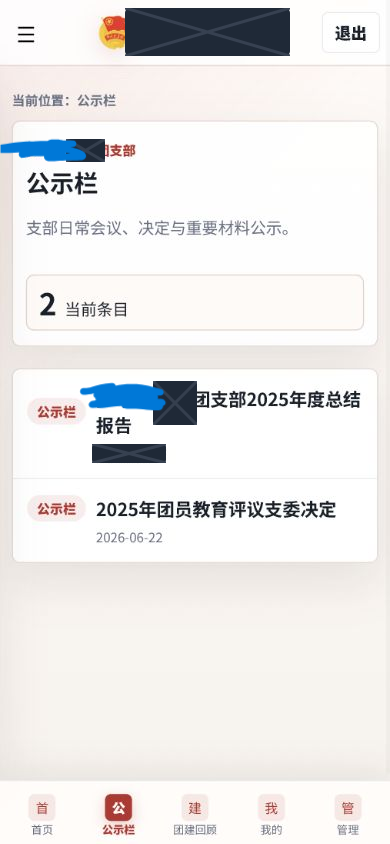

# 用户使用手册

## 1. 登录与账户

使用支部发放的学号和初始密码登录，并完成 Turnstile 人机验证。首次登录必须设置不少于 12 位的新密码。“我的”页面可修改昵称和密码；修改密码后，其他既有会话会失效。

顶栏按北京时间显示问候、昵称和学号。不要共享账号、密码、缴费二维码或下载后的敏感文件。

## 2. 页面功能

- **首页**：显示支部信息、常用模块、个人团费状态以及最近公示和活动。
- **公示栏**：按发布日期查看材料；PDF 和图片可预览，下载策略由附件设置决定。
- **团建回顾**：支持搜索、年份筛选和新到旧、旧到新、自定义顺序。
- **团费缴纳**：显示二维码、说明、进度和个人状态；成员可提交“我已缴纳”。
- **团徽团旗团歌**：先显示使用规范，再提供官方资料；此类资料通常不加个人水印。
- **我的**：查看学号和支部，修改昵称和密码。

首页、“我的”和登录页底部提供 Github 主页、Cloudflare Pages 和问题反馈入口。

## 3. 身份与内容状态

- `admin`：管理用户、内容、附件、团费、设置和统计。
- `editor`：管理内容和附件，但不能管理用户或关键站点设置。
- `member`：浏览获准内容、下载文件并管理自己的昵称、密码和团费状态。
- `published`：已发布，符合权限的成员可见。
- `draft`：草稿，仅管理员和编辑可见。
- `archived`：已归档，普通成员默认不可见。

## 4. 下载与水印

需水印的 PDF 或图片会生成包含昵称/学号、北京时间和用途的衍生 PDF。现有 PDF 通过增量更新保留原始资源和嵌入字体。PDF 权限不是 DRM，无法可靠阻止复制、截图、拍照或人工转录。

## 5. 常见问题

- **登录失效**：重新登录；改密或管理员重置后旧会话会被注销。
- **PDF 暂未显示**：检查网络；受保护 PDF 需要管理员提供正确所有者密码后处理。
- **首次下载较慢**：服务器首次生成个人水印副本，后续会复用缓存。
- **人机验证未出现**：关闭拦截脚本的扩展、刷新，并确认可以访问 `challenges.cloudflare.com`。

最后更新时间：2026-06-22（北京时间）

---

# User Guide

## 1. Sign-in and Account

Sign in with the student ID and initial password issued by the branch, then complete Turnstile verification. On first sign-in, replace the initial password with one of at least 12 characters. The Profile page lets you change your nickname and password; changing the password invalidates other existing sessions.

The header shows a Beijing-time greeting, nickname, and student ID. Do not share accounts, passwords, payment QR codes, or downloaded sensitive files.

## 2. Page Features

- **Home**: shows branch information, common modules, personal payment status, and recent notices and activities.
- **Notices**: lists materials by publication date; PDFs and images can be previewed, and attachment settings determine download policy.
- **Activities**: supports search, year filtering, and newest, oldest, or custom ordering.
- **Membership Fees**: shows the QR code, instructions, progress, and personal status; members may submit “I have paid.”
- **Emblem, Flag and Song**: shows usage rules before official resources; these materials are normally not personally watermarked.
- **Profile**: shows the student ID and branch and lets the user change nickname and password.

The Home, Profile, and sign-in footers provide links to the Github profile, Cloudflare Pages, and issue feedback.

## 3. Roles and Content Statuses

- `admin`: manages users, content, attachments, payments, settings, and statistics.
- `editor`: manages content and attachments but cannot manage users or critical site settings.
- `member`: browses authorized content, downloads files, and manages their own nickname, password, and payment status.
- `published`: published and visible to authorized members.
- `draft`: a draft visible only to administrators and editors.
- `archived`: archived and hidden from ordinary members by default.

## 4. Downloads and Watermarks

Protected PDFs or images produce derivative PDFs containing the nickname/student ID, Beijing time, and purpose. Existing PDFs use incremental updates that preserve original resources and embedded fonts. PDF permissions are not DRM and cannot reliably prevent copying, screenshots, photography, or manual transcription.

## 5. Troubleshooting

- **Session expired**: sign in again; password changes or administrator resets revoke old sessions.
- **PDF not displayed yet**: check the network; a protected PDF needs the correct owner password from an administrator before processing.
- **First download is slower**: the server generates a personal watermarked copy once and reuses its cache later.
- **Human verification is missing**: disable script-blocking extensions, refresh, and confirm access to `challenges.cloudflare.com`.

Last updated: 2026-06-22 (Beijing Time)
